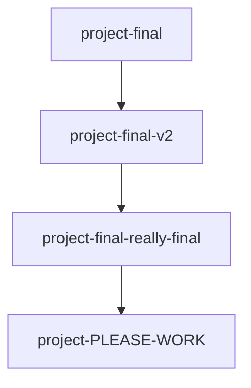

# 🕰️ Introduction to Git and Version Control

***
| [Next: Install Git ➡️](02-install-git.md) |
| :---: |
***

**🎯 Learning Objective:** By the end of this module, you will understand the fundamental technical difference between Git (a local CLI engine) and GitHub (a cloud hosting platform), and why Version Control is a mandatory industry standard.

## ⚙️ What it does
Think of Git as a "time machine" for your code. Technically, it is a Distributed Version Control System (DVCS). It operates by taking a cryptographic snapshot of your project exactly as it looks at a certain moment in time, allowing you to seamlessly revert to previous states (`commits`) if something breaks.

> [!IMPORTANT]
> **Git ≠ GitHub.** 
> **Git** is the CLI engine running locally on your laptop tracking changes.
> **GitHub** is the cloud website where you securely synchronize your local Git snapshots to share them with the world.

## 🧠 Why it exists
Before Git, people used to save multiple copies of folders, creating massive confusion across teams:



Git solves this by keeping an elegant, immutable history in the background (within a hidden `.git` folder). It guarantees that you can safely experiment without losing data, and explicitly records who authored each modification.

## 📅 When to use it
You should use Git for **every single project**, no matter how small. Having a local version history that lets you "undo" catastrophic mistakes is a fundamental engineering safety net.

## ✅ How to verify
Once we install Git in the next module, your verification step will simply be ensuring your terminal recognizes the executable binaries:
```bash
git --version
```

***
| [Next: Install Git ➡️](02-install-git.md) |
| :---: |
