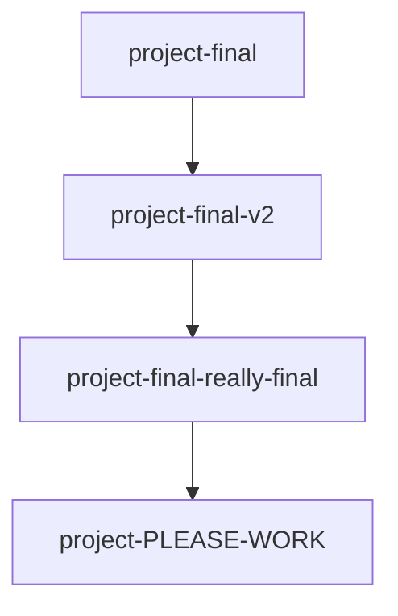

# Introduction to Git and Version Control

## What it does
Think of Git as a "time machine" for your code. It's a tool that takes a snapshot of your project exactly as it looks at a certain moment in time. If you make a mistake later, you can easily use Git to travel back to a working snapshot.

*Note: Git is the tool you install on your computer. GitHub is the website where you share your Git snapshots securely with the world.*

## Why it exists
Before Git, people used to save multiple copies of folders when they were scared of breaking things. You probably know the feeling of having files named like this:



This gets messy fast, especially when working with teammates! Git solves this by keeping track of changes elegantly in the background, showing you exactly who changed what, and when.

## When to use it
You should use Git for **every single project**, no matter how small. Even if you're the only person working on it, having a safety net that lets you undo a catastrophic mistake is a superpower.

## How to verify
Once we configure Git in the upcoming lessons, you will verify your environment is working by opening your terminal and typing:
```bash
git --version
```
If your terminal replies back with a version number, your time machine is ready to go!
