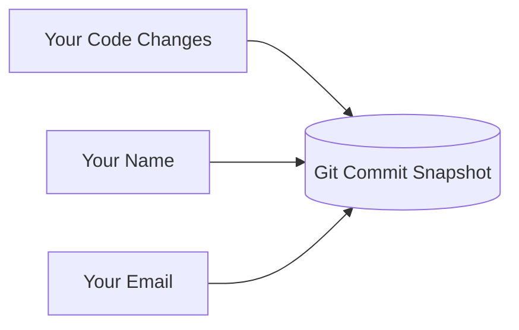

# 🏷️ Configure your Git identity

***
| [⬅️ Previous: Install Git](02-install-git.md) | [Next: Setup SSH ➡️](04-ssh-setup.md) |
| :--- | ---: |
***

**🎯 Learning Objective:** Understand the strict technical difference between Git Author Metadata ("Name Tags") and actual Repository Authentication ("Passwords/Keys").

## ⚙️ What it does
This global configuration embeds a "Name Tag" into your code. Whenever you record a snapshot (`commit`), your name and structural email are permanently attached to the metadata.



## 🧠 Why it exists
Git is heavily decentralized. When multiple software engineers collaborate on hundreds of files, Git tracks explicitly *who* authored each line via these `user.name` and `user.email` variables. 

> [!CAUTION]
> **Name Tag vs Authentication**
> Setting this identity *does not give you access to push code onto a GitHub server*. Think of it merely as writing your name on a test sheet. Because anyone can theoretically type *your* email on their machine, we will secure your identity against spoofing using cryptographic SSH tools in the following modules.

## 📅 When to use it
Run exactly once globally on your workstation. Ensure the email precisely matches the primary email associated with your GitHub account for proper contribution attribution. 

```bash
git config --global user.name "Your First and Last Name"
git config --global user.email "your_email@example.com"
```

## ✅ How to verify

Read back your global configuration keys to ensure they successfully persisted in your `~/.gitconfig` file:
```bash
git config --global --list
```
Look through the parsed output block. If `user.name` and `user.email` correctly reflect your strings, you have completed identity registration!

***
| [⬅️ Previous: Install Git](02-install-git.md) | [Next: Setup SSH ➡️](04-ssh-setup.md) |
| :--- | ---: |
