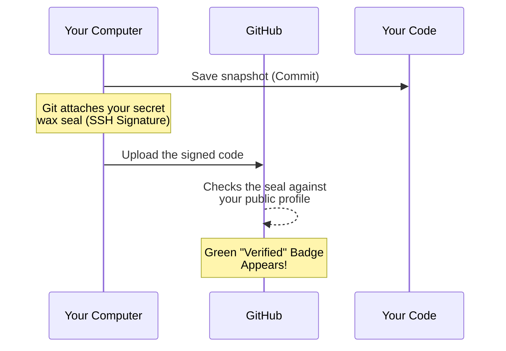

# Commit Signing

## What it does
Commit signing is like putting a wax seal on a letter. It proves to everyone that the letter actually came from you and hasn't been tampered with. On GitHub, it gives your code a shiny, green **"Verified"** badge!

## Why it exists
Remember the "Name Tag" we set up in the last step? Anyone could technically configure their Git to use *your* email and pretend to be you. 
Signing your commits uses an un-fakeable digital fingerprint (your SSH key) to say, "Yes, these changes were authentically made by me."



## When to use it
Set this up right after you finish creating your SSH Key (we will do that in the very next module). Once your key is ready, you tell Git to sign *every* snapshot you take.

*(After you finish the next module to get your SSH key, come back and run this:)*

```bash
git config --global gpg.format ssh
git config --global user.signingkey ~/.ssh/id_ed25519.pub
git config --global commit.gpgsign true
```

## How to verify
The easiest way to verify is to push some code to your repository on github.com. Look at your history: if you see a green **"Verified"** pill next to your snapshot, you are a certified Git pro!
