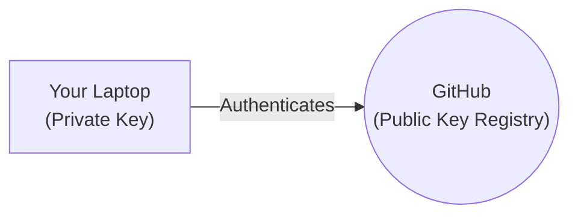

# 🔐 Setup SSH Authentication

***
| [⬅️ Previous: Configure Identity](03-configure-identity.md) | [Next: Commit Signing ➡️](05-commit-signing.md) |
| :--- | ---: |
***

**🎯 Learning Objective:** Learn how Public-Key Cryptography secures your connection to remote servers. You will generate an `ed25519` key pair, load it into your `ssh-agent`, and register it as an **Authentication Key** in GitHub.

## ⚙️ What it does
Imagine needing a highly secure VIP badge to push code. You generate a paired cryptographic sequence: one key stays hidden on your local machine (`Private Key`), and you safely upload the other piece to the remote platform (`Public Key`).



## 🧠 Why it exists
Historically, you had to type your GitHub account password into the terminal for every `git push`. GitHub permanently deprecated password authentication in favor of Personal Access Tokens (PATs) and SSH Keys to prevent credential leakage. 

> [!TIP]
> **Teacher Note: Why ed25519?** We strictly recommend the `ed25519` cryptographic algorithm instead of older `RSA`. It compiles instantly, uses fewer bits, and relies on an elliptic curve mathematically engineered to resist modern attack vectors.

## 📅 When to use it
You execute this sequence **once** per OS installation on a new machine.

### Step 1: Generate the Key Pair
```bash
ssh-keygen -t ed25519 -C "your_email@example.com"
```
Press **Enter** to accept the default output path (`~/.ssh/id_ed25519`). Press **Enter** again to skip the optional passphrase (unless preferred).

### Step 2: Empower the SSH Agent
For your system to seamlessly fetch the key without prompting you in the background, you must start the native `ssh-agent` utility and securely load your newly generated private key into its memory:
```bash
eval "$(ssh-agent -s)"
ssh-add ~/.ssh/id_ed25519
```

### Step 3: Register the Public Key (Authentication)
We must extract the un-secret half of your badge (`id_ed25519.pub`) and upload it to GitHub as an **Authentication** key.

1. Print the public payload in your terminal:
```bash
cat ~/.ssh/id_ed25519.pub
```
2. Copy the entire string (starts with `ssh-ed25519`).
3. Navigate to **GitHub > Settings > SSH and GPG keys**.
4. Click **New SSH key**. 
5. Under **"Key type"**, explicitly ensure **Authentication Key** is selected. Paste the payload and save.

## ✅ How to verify

Command your terminal to attempt an interactive Secure Shell handshake against GitHub's root node:
```bash
ssh -T git@github.com
```

If it successfully replies `Hi [username]! You've successfully authenticated...`, your identity is correctly mapped!

***
| [⬅️ Previous: Configure Identity](03-configure-identity.md) | [Next: Commit Signing ➡️](05-commit-signing.md) |
| :--- | ---: |
