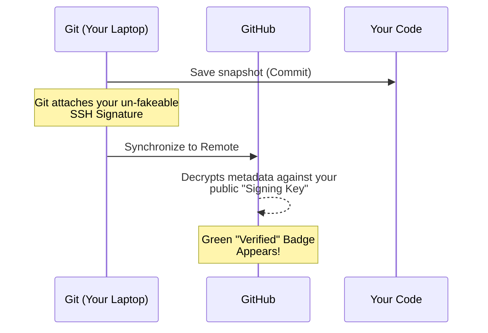

# 🖋️ Commit Signing

***
| [⬅️ Previous: Setup SSH](04-ssh-setup.md) | [Next: Your First Commit ➡️](06-first-commit.md) |
| :--- | ---: |
***

**🎯 Learning Objective:** You will apply cryptographic SSH signatures to your commits. Understand the difference between pushing code securely vs explicitly signing who wrote it to earn the trusted **"Verified"** badge.

## ⚙️ What it does
Commit signing attaches a cryptographic "Wax Seal" to every revision you author. It undeniably proves that the payload (`commit`) hasn't been tampered with and originated precisely from you. 

## 🧠 Why it exists
Remember the "Name Tag" from module 03? A rogue programmer can modify their Git configuration to use your email and push fake commits pretending to be you. 
Signing uses the private key stored safely on your laptop to cryptographically sign the metadata, fully securing the collaboration supply chain.



> [!WARNING]
> **Technical requirement:** SSH commit signatures explicitly compel a local Git binary of **`2.34+`** or higher. Run `git --version` to ensure compatibility.

## 📅 When to use it
We will configure Git to sign **every** snapshot using the same SSH key pair we generated previously for authentication. 

### Step 1: Register the Key as a Signing Key
Before GitHub can analyze your seals, you must re-upload the public key, explicitly tagged for signing.

1. Recall your public key to the clipboard: `cat ~/.ssh/id_ed25519.pub`
2. Navigate to **GitHub > Settings > SSH and GPG keys**.
3. Click **New SSH key**.
4. This time, under **"Key type"**, explicitly select **Signing Key**. Paste the payload and save.

### Step 2: Configure Global Git Signatures
*(Execute these locally to enforce signing globally!)*
```bash
git config --global gpg.format ssh
git config --global user.signingkey ~/.ssh/id_ed25519.pub
git config --global commit.gpgsign true
```

## ✅ How to verify
Once we create our first repository in the next module and push it online, inspect your commit history via the GitHub UI. A green **"Verified"** pill confirms the entire architectural chain works flawlessly.

***
| [⬅️ Previous: Setup SSH](04-ssh-setup.md) | [Next: Your First Commit ➡️](06-first-commit.md) |
| :--- | ---: |
