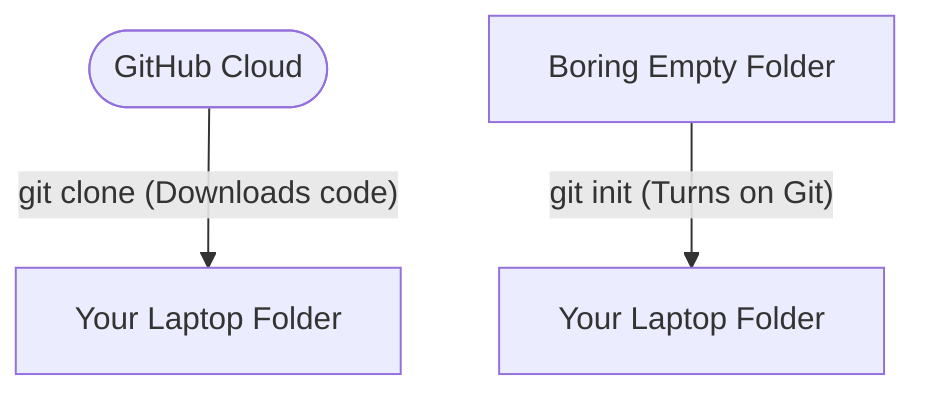

# 📂 Create or Clone a Repository

## ⚙️ What it does
This is how you get your project's folders and files onto your actual computer. 
- **Create (`init`)** magically transforms an empty, boring folder on your laptop into a Git-powered project.
- **Clone (`clone`)** downloads an entire existing project from GitHub straight to your laptop.



## 🧠 Why it exists
Git works by tracking all your files inside a secret, hidden folder called `.git`. This tiny folder acts like the brain of your project. Whether you initialize a brand new project, or you clone down a project from the internet, you are just ensuring that this "brain folder" gets created so Git can start watching your edits.

## 📅 When to use it

**If you are starting a brand new project from scratch:**
```bash
mkdir my-awesome-project
cd my-awesome-project
git init
```

**If you found a project on GitHub and want it on your laptop:**
Find the green "Code" button on GitHub, select "SSH", and copy the link.
```bash
git clone git@github.com:username/repo.git
```

## ✅ How to verify

If you created a new blank project (`init`):
```bash
git status
```
Git should politely respond that you are "On branch main" or "On branch master".

If you downloaded an existing project (`clone`):
```bash
ls -la
```
Open the folder you downloaded and look around. You should see all the project files, plus that hidden `.git` folder waiting quietly to do its job!
