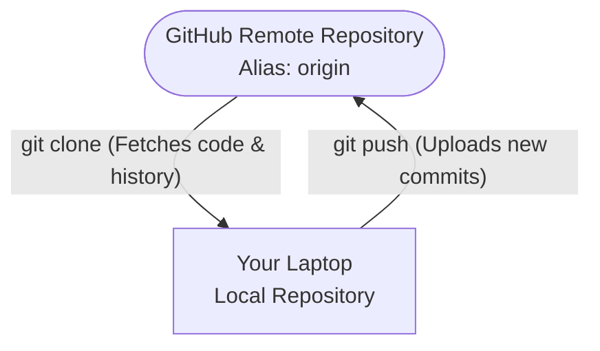

# 📡 Remotes and Cloning

***
| [⬅️ Previous: Your First Commit](06-first-commit.md) | [Next: Forks vs Branches ➡️](08-fork-origin-upstream.md) |
| :--- | ---: |
***

**🎯 Learning Objective:** Connect local repositories to remote servers, clone existing codebase architectures, and understand the technical purpose of the default `origin` remote alias.

## ⚙️ What it does
- **Clone (`clone`)** downloads a full snapshot of an existing repository from a remote server (like GitHub) to your local file system, including the entire `.git` history.
- **Remotes (`remote`)** are aliased URL pointers. They serve as a mapping directory connecting your local repository to external, hosted versions of the code.

## 🧠 Why it exists
Without remotes, Git would only function as an offline tracker on a single machine. Remotes enable the distributed, multiplayer capability of Git.

> [!NOTE]
> **What exactly is `origin`?**
> When you execute `git clone`, Git needs to remember where the code was downloaded from. Rather than continually re-typing long uniform resource locators (URLs) like `git@github.com:facebook/react.git`, Git establishes a default local nickname for that remote URL. By universal convention, this default nickname is `origin`.

## 📅 When to use it
We will clone a repository to examine the resulting `origin` remote.

**Find a project via GitHub:** Select the green "Code" dropdown tab, verify the SSH protocol is targeted, and copy the repository URL.



**Clone it natively onto your workstation:**
```bash
git clone git@github.com:username/repo-name.git
```

## ✅ How to verify

Navigate into the newly cloned directory. Inspect the configured network mappings assigned to this specific repository:
```bash
cd repo-name
git remote -v
```

Your output will structurally confirm `origin` mapped successfully to the cloud:
`origin    git@github.com:username/repo-name.git (fetch)`
`origin    git@github.com:username/repo-name.git (push)`

***
| [⬅️ Previous: Your First Commit](06-first-commit.md) | [Next: Forks vs Branches ➡️](08-fork-origin-upstream.md) |
| :--- | ---: |
