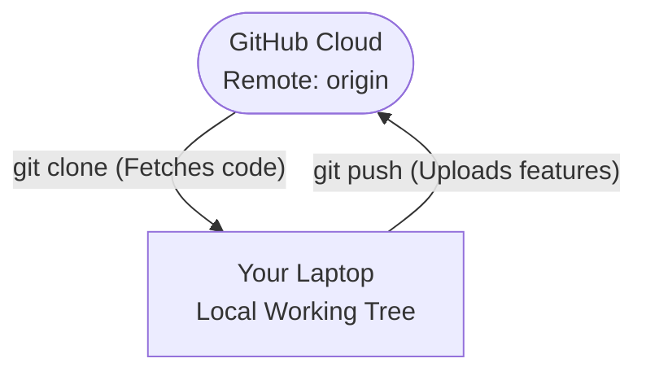

# 📡 Remotes and Cloning

***
| [⬅️ Previous: Your First Commit](06-first-commit.md) | [Next: Forks vs Branches ➡️](08-fork-origin-upstream.md) |
| :--- | ---: |
***

**🎯 Learning Objective:** Connect localized repositories to cloud environments by mapping SSH endpoints, demystifying the industry default Remote pointer: `origin`.

## ⚙️ What it does
- **Clone (`clone`)** securely pulls an entire existing project from GitHub's servers traversing straight to your laptop via SSH.
- **Remotes** act as your network addressing book. A Remote mathematically binds a local `.git` module directly to a URL hosted externally.

## 🧠 Why it exists
`origin` is often wrongly assumed to be a powerful, complicated concept. 

> [!NOTE]
> **Teacher Note: Origin isn't magic.** 
> When you execute `git clone`, Git has to remember securely *where* that code came from. Rather than forcing you to memorize long URLs like `git@github.com:facebook/react.git` forever, Git simply registers a "nickname" for that URL onto your machine. The default fallback nickname globally accepted by convention is `origin`.

## 📅 When to use it
We will clone an existing repository to experiment with the `origin` abstraction. 

**Find a project via GitHub:** Select the green "Code" dropdown, ensure SSH architecture is highlighted, and copy the string.



**Clone it onto your workstation architecture:**
```bash
git clone git@github.com:username/repo-name.git
```

## ✅ How to verify

Navigate into your successfully cloned folder. Inspect the "network addressing book" native to this folder specifically:
```bash
cd repo-name
git remote -v
```

You will read an output structure displaying:
`origin    git@github.com:username/repo-name.git (fetch)`
This proves `origin` is mapped successfully back to the cloud.

***
| [⬅️ Previous: Your First Commit](06-first-commit.md) | [Next: Forks vs Branches ➡️](08-fork-origin-upstream.md) |
| :--- | ---: |
