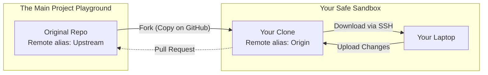

# 🔀 Forks vs Branches

***
| [⬅️ Previous: Remotes and Cloning](07-remotes-and-cloning.md) | [Next: Troubleshooting ➡️](09-troubleshooting.md) |
| :--- | ---: |
***

**🎯 Learning Objective:** Learn exactly when to implement a feature Branch directly vs creating a server-side Fork. Demystify the `upstream` remote configuration.

## ⚙️ What it does
Branches and Forks both exist to isolate code experimentation away from active production:
- **Branch**: Internal isolation inside a repository you have direct write privileges over.
- **Fork**: A fully standalone structural server-side clone explicitly tied to your account for a repository *that restricts your write privileges*.

## 🧠 Why it exists
When working on open source libraries or secure enterprise tooling, maintainers actively restrict pushes to default code bases. Instead of Branching inward, you Fork outward securely into a standalone Sandbox you control (`origin`). 

By modifying your Fork (`origin`), you then deploy a structured architecture request back to the maintainers—traditionally known as a **Pull Request**.



## 📅 When to use it

If integrating with a repository restricting your standard write permissions, seamlessly instantiate the "Fork and Pull" triangular workflow:

1. **Fork:** Click the "Fork" UI button on the targeted GitHub project page to allocate it to your account natively.
2. **Clone:** Pull *your* copy down. Git tags your accessible clone default remote string as `origin`.
```bash
git clone git@github.com:your-username/the-forked-repo.git
```
3. **Connect to Upstream:** Connect to the original structure to keep your feature modules synchronized against new code maintainers ship while you work. Remember, since this is a different URL, you generate a second Remote alias traditionally nicknamed `upstream`.
```bash
git remote add upstream git@github.com:original-creator/the-repo.git
```

## ✅ How to verify

Command your terminal to list both your remote access vectors securely:
```bash
git remote -v
```

The output validates success, showing your write-accessible fork (`origin`) seamlessly sharing a tree with the main source (`upstream`):
```text
origin    git@github.com:your-username/the-forked-repo.git (fetch)
origin    git@github.com:your-username/the-forked-repo.git (push)
upstream  git@github.com:original-author/the-repo.git (fetch)
...
```

***
| [⬅️ Previous: Remotes and Cloning](07-remotes-and-cloning.md) | [Next: Troubleshooting ➡️](09-troubleshooting.md) |
| :--- | ---: |
