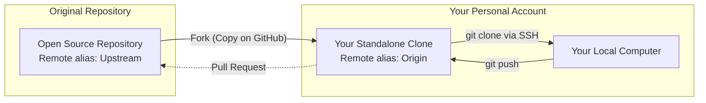

# 🔀 Forks vs Branches

***
| [⬅️ Previous: Remotes and Cloning](07-remotes-and-cloning.md) | [Next: Troubleshooting ➡️](09-troubleshooting.md) |
| :--- | ---: |
***

**🎯 Learning Objective:** Learn exactly when to implement a feature Branch directly vs creating a server-side Fork. Demystify the `upstream` remote configuration.

## ⚙️ What it does
Branches and Forks both exist to isolate feature development away from production code bases:
- **Branch**: An internal pointer dividing history inside a single repository where you have direct write permissions.
- **Fork**: A fully standalone, server-side clone explicitly tied to your GitHub account, typically utilized for an external repository where you lack direct write permissions on the original.

## 🧠 Why it exists
When contributing to open-source libraries or secure enterprise tooling, maintainers actively restrict direct pushes to the default (`main`) branch to protect overall integrity. Instead of branching within their repository, you **Fork** outward securely into an isolated repository you own. 

By pushing commits to your Fork (your `origin`), you then deploy a structured merge request back to the maintainers—traditionally known as a **Pull Request (PR)**.



## 📅 When to use it

If integrating features into a repository that restricts your standard push permissions, effectively execute the "Fork and PR" triangular workflow:

1. **Fork:** Click the "Fork" UI button on the targeted GitHub project page to allocate an identical copy under your account.
2. **Clone:** Pull *your* copy down. Git inherently labels your accessible clone's remote as `origin`.
```bash
git clone git@github.com:your-username/the-forked-repo.git
```
3. **Connect to Upstream:** You need to maintain synchronization with the original maintainers. Add the original URL as a secondary remote, classically nicknamed `upstream`.
```bash
git remote add upstream git@github.com:original-creator/the-repo.git
```

## ✅ How to verify

List both remote access vectors to ensure proper routing:
```bash
git remote -v
```

The output validates success, showing your write-accessible fork (`origin`) seamlessly configured alongside the original source (`upstream`):
```text
origin    git@github.com:your-username/the-forked-repo.git (fetch)
origin    git@github.com:your-username/the-forked-repo.git (push)
upstream  git@github.com:original-author/the-repo.git (fetch)
...
```

***
| [⬅️ Previous: Remotes and Cloning](07-remotes-and-cloning.md) | [Next: Troubleshooting ➡️](09-troubleshooting.md) |
| :--- | ---: |
